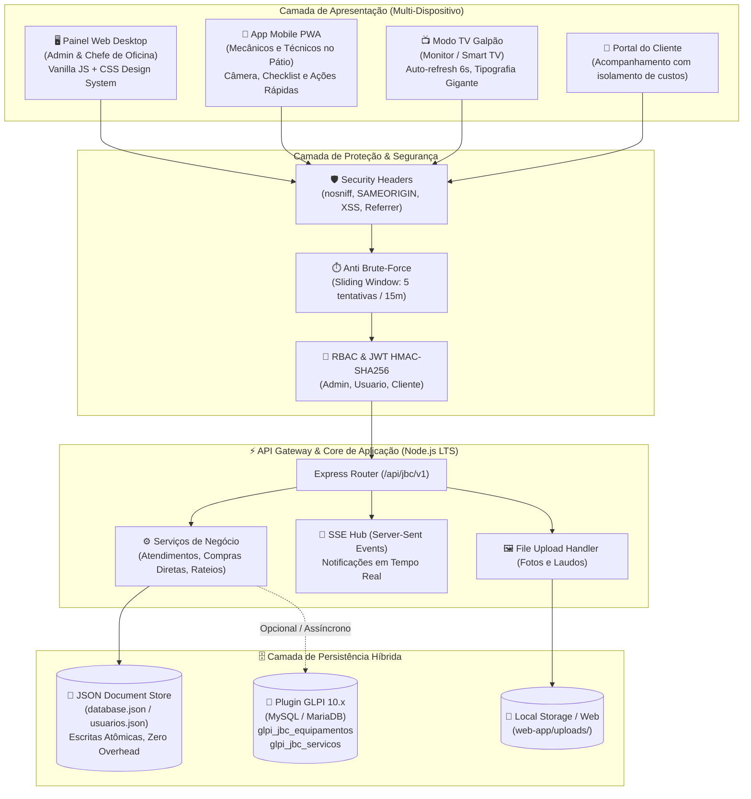
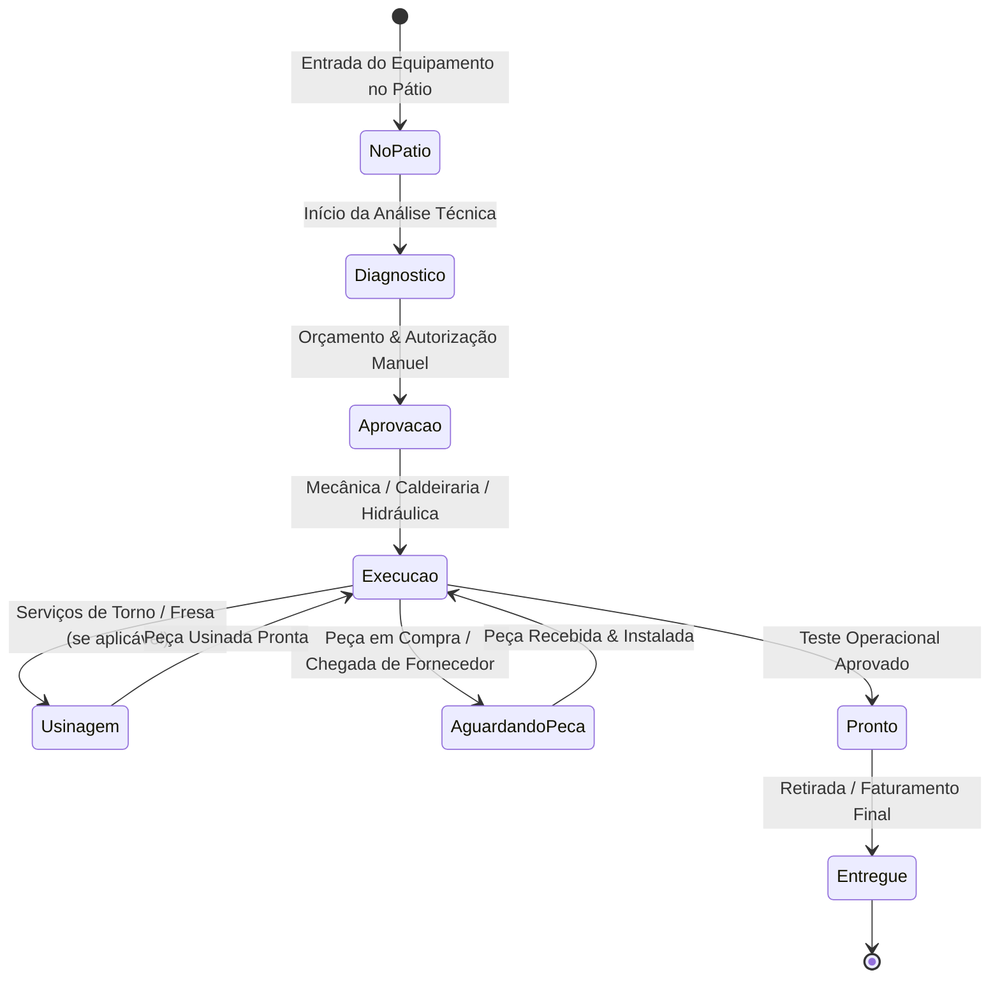
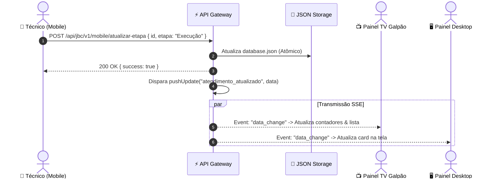
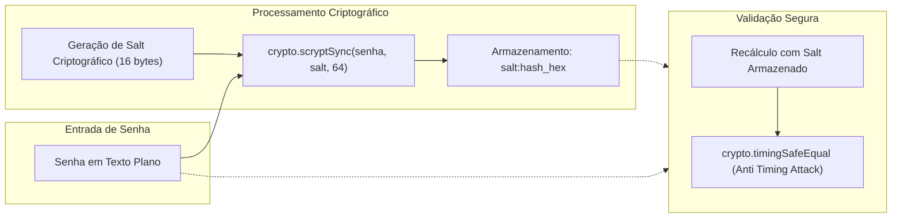

# 🏛️ Documentação de Arquitetura de Software — Gestão de Pátio & Oficina JB Cunha

Este documento detalha as decisões técnicas, padrões arquiteturais, fluxos de dados, modelos de persistência e especificações de segurança que compõem o sistema **Gestão de Pátio JB Cunha**.

---

## 1. Visão Geral da Arquitetura

O sistema adota o padrão **Monólito Modular Pragmático**, estruturado com separação rígida entre a camada de apresentação (Frontend SPA / PWA), a camada de coordenação e API (API Gateway Node.js/Express) e a camada de armazenamento híbrido (banco documental local para tempo real na oficina e banco relacional MySQL para o núcleo corporativo GLPI).

### Diagrama Estrutural em Camadas



---

## 2. Princípios Arquiteturais e Diretrizes de Design

1. **Zero Bloatware / Zero Compilação no Frontend**:
   - A interface do usuário é construída com **HTML5 semântico, Vanilla CSS moderno e Vanilla JavaScript (ES6+)**.
   - Não depende de bundlers complexos (Webpack, Vite ou Babel) para execução em produção. O código servido é diretamente legível, auditável e editável em qualquer máquina.
2. **Latência Mínima e Alta Disponibilidade na Oficina**:
   - Uma oficina pesada não pode parar caso a conexão de internet externa oscile.
   - O núcleo operacional roda localmente na rede interna (LAN Wi-Fi), permitindo que computadores, celulares e o televisor do galpão operem com latência inferior a 15ms.
3. **Escrita Atômica e Imutabilidade de Transações Locais**:
   - As alterações em `database.json` e `usuarios.json` utilizam estratégias de serialização síncrona/atômica (`fs.writeFileSync` com temp-file swap), evitando estados corrompidos por falhas de energia.
4. **Isolamento Estrito Multitenant**:
   - Usuários do perfil `cliente` possuem blindagem completa a nível de camada de serviço: não conseguem listar nem inferir dados de clientes concorrentes.

---

## 3. Fluxo de Vida de um Atendimento no Pátio



### Detalhamento das Etapas do Fluxo:
| Etapa | Responsável Primário | Gatilho / Ação | Visibilidade TV |
|---|---|---|---|
| **No Pátio** | Recepção / Técnico | Registro da placa, horímetro e queixa do cliente | Status Azul |
| **Diagnóstico** | Mecânico Líder | Desmontagem preliminar, fotos de trincas e laudo | Status Amarelo |
| **Aprovação** | Gerência (Manuel) | Avaliação de custos e peças necessárias | Status Laranja |
| **Execução** | Equipe Operacional | Aplicação de mão de obra e montagem | Status Ciano (Pulsante) |
| **Aguardando Peça** | Compras / Almoxarifado | Requisição no módulo de compras diretas | Status Vermelho de Alerta |
| **Usinagem** | Torneiro / Soldador | Recuperação de olhais, pinos e buchas | Status Roxo |
| **Pronto** | Controle de Qualidade | Teste de carga e liberação para transporte | Status Verde |
| **Entregue** | Faturamento / Cliente | Saída da oficina física, registro no histórico | Arquivado |

---

## 4. Arquitetura de Comunicação em Tempo Real (SSE)

Para garantir que celulares de técnicos e o painel de TV reflitam mudanças instantaneamente sem o overhead de WebSockets ou polling excessivo, o sistema utiliza **Server-Sent Events (SSE)** em `/api/jbc/v1/mobile/stream`.



---

## 5. Arquitetura de Segurança & Criptografia



### Especificações Criptográficas:
- **Hashing de Senhas**: Algoritmo `scrypt` com memória reforçada (nativo de `crypto` no Node.js). Não utiliza bibliotecas externas C++ (evita dependências de compilação em diferentes SOs).
- **Proteção de Tokens**: Tokens de autenticação assinados com `HMAC-SHA256` utilizando chave simétrica de 48 bytes gerada na inicialização e protegida com permissão `0o600`.
- **Anti Força-Bruta**: Limitador em memória via mapa deslizante monitorando pares `(IP + Usuário)`. 5 falhas consecutivas bloqueiam o originador por 15 minutos.
- **Cabeçalhos OWASP**:
  - `X-Content-Type-Options: nosniff`
  - `X-Frame-Options: SAMEORIGIN`
  - `X-XSS-Protection: 1; mode=block`
  - `Referrer-Policy: strict-origin-when-cross-origin`

---

## 6. Modelo de Dados Comparativo

### 6.1. Modelo Documental Local (`database.json`)
```json
{
  "versao": "3.1",
  "atualizado_em": "ISO-8601",
  "atendimentos": [
    {
      "id": 1,
      "codigo": "AT-0001",
      "cliente": "Empresa ABC Mineração",
      "veiculo": "Retroescavadeira CAT 416E",
      "placa": "BRA2E19",
      "horimetro": 4520.5,
      "km": 82000,
      "etapa": "Execução",
      "baia": "Baia 02 - Mecânica Pesada",
      "servico": "Revisão geral do comando hidráulico e troca de vedantes",
      "compras_diretas": [
        {
          "id": "comp_01",
          "descricao": "Kit Vedação Cilindro Mestre",
          "fornecedor": "Hidráulica Brasil",
          "valor": 850.00,
          "status": "Aprovado"
        }
      ],
      "historico_atividades": []
    }
  ]
}
```

### 6.2. Modelo Relacional GLPI (`install.sql`)
O módulo corporativo expande o GLPI 10 com as tabelas:
- **`glpi_jbc_equipamentos`**: Vinculada a `glpi_computers`/`glpi_items`, guarda placa, chassi, horímetro, ano e baia física.
- **`glpi_jbc_servicos`**: Vinculada a `glpi_tickets`, mapeia as etapas da oficina, números de ERP (Orçamento, OS, NF).
- **`glpi_jbc_garagem`**: Cadastro de baias e setores físicos do galpão.
- **`glpi_jbc_movimentacoes`**: Trilha de auditoria das movimentações físicas dos ativos entre baias.
- **`glpi_jbc_evidencias`**: Metadados de fotos anexadas e laudos técnicos periciais.
- **`glpi_jbc_erp_sync`**: Controle de sincronismo bidirecional de orçamentos e faturamentos.
