# 🏗️ Guia de Infraestrutura, Redes e Implantação — Gestão de Pátio JB Cunha

Este guia descreve detalhadamente as três topologias de implantação do sistema, configurações de rede, infraestrutura de monitoramento de galpão (Modo TV) e planos de recuperação de desastres (Disaster Recovery).

---

## 1. Topologias de Implantação

```mermaid
graph TD
    subgraph TopologiaA ["Topologia A: On-Premises (Oficina Física / Edge)"]
        PCWin["💻 PC Principal Windows 10/11\n(Node.js + Storage Local)"]
        Roteador["📶 Roteador Wi-Fi do Galpão\n(IP Fixo / DHCP Reservado: 192.168.1.100)"]
        TVGalpao["📺 Smart TV / Monitor HDMI\n(Modo TV: http://192.168.1.100:3000/#tv)"]
        MecMobile["📱 Celulares dos Mecânicos\n(PWA: http://192.168.1.100:3000/mobile)"]

        PCWin --> Roteador
        Roteador --> TVGalpao
        Roteador --> MecMobile
    end

    subgraph TopologiaB ["Topologia B: Servidor Linux / Cloud VPS"]
        VPS["☁️ VPS Ubuntu 22.04 LTS\n(Node.js 20 + PM2)"]
        NginxProxy["🛡️ Nginx Reverse Proxy\n(SSL/TLS Let's Encrypt + HTTP/2)"]
        Domain["🌐 patio.jbcunha.com.br"]

        Domain --> NginxProxy --> VPS
    end

    subgraph TopologiaC ["Topologia C: Docker & Containers"]
        DHost["🐳 Docker Engine + Compose"]
        ContApp["📦 Container jbcunha-gestao-patio"]
        VolData[("📁 Volume: ./api-gateway/data")]
        VolMedia[("📂 Volume: ./web-app/uploads")]

        DHost --> ContApp
        ContApp --- VolData
        ContApp --- VolMedia
    end
```



---

## 2. Topologia A: On-Premises / Oficina Física (Windows)

Esta é a configuração padrão para oficinas que operam prioritariamente em rede local.

### 2.1. Requisitos de Hardware
- **Computador Principal (Servidor da Oficina)**:
  - Sistema Operacional: Windows 10 ou 11 (64-bit).
  - Processador: Intel Core i3 / AMD Ryzen 3 ou superior.
  - Memória RAM: 4 GB mínimo (8 GB recomendado).
  - Armazenamento: SSD com pelo menos 10 GB livres.
  - Placa de Rede: Ethernet Gigabit (recomendado) ou Wi-Fi 5GHz.

### 2.2. Configuração de Rede & IP Estático
Para que celulares e a TV do galpão nunca percam o endereço do sistema, fixe o IP do computador no roteador da oficina:
1. Abra o PowerShell e digite `ipconfig` para identificar seu IP atual e o Gateway Padrão.
2. No painel de administração do roteador (geralmente `192.168.1.1` ou `192.168.0.1`), configure a **Reserva de Endereço DHCP (DHCP Static Lease)** vinculando o endereço MAC da placa de rede do computador a um IP fixo (ex: `192.168.1.100`).
3. Libere a porta `3000` no Firewall do Windows:
   ```powershell
   New-NetFirewallRule -DisplayName "Central JB Cunha Port 3000" -Direction Inbound -LocalPort 3000 -Protocol TCP -Action Allow
   ```

### 2.3. Inicialização Automática com o Windows
Para que a oficina ligue o sistema sozinho ao ligar o computador pela manhã:
1. Pressione `Win + R`, digite `shell:startup` e pressione Enter.
2. Crie um atalho do arquivo `INICIAR_OFICINA.bat` dentro da pasta de Inicialização aberta.
3. Toda vez que o Windows iniciar, o servidor Node.js subirá automaticamente e abrirá a tela no navegador.

### 2.4. Configuração da TV do Galpão
- **Opção 1 (Cabo HDMI Direto)**: Conecte a TV na saída HDMI secundária do computador, configure o Windows para "Estender estes vídeos", arraste uma janela do navegador até a TV e acesse `http://localhost:3000/#tv`. Pressione `F11` para tela cheia.
- **Opção 2 (Smart TV / TV Box Android)**: Abra o navegador nativo da Smart TV conectado ao Wi-Fi da oficina e acesse `http://192.168.1.100:3000/#tv`. O painel atualiza a cada 6 segundos sozinho.

---

## 3. Topologia B: Implantação em Servidor Linux (VPS / Nuvem)

Recomendada quando filiais, clientes externos ou diretores precisam acessar o sistema fora da rede interna da oficina.

### 3.1. Provisionamento do Servidor (Ubuntu 22.04 LTS)
```bash
# 1. Atualizar pacotes
sudo apt update && sudo apt upgrade -y

# 2. Instalar Node.js 20 LTS
curl -fsSL https://deb.nodesource.com/setup_20.x | sudo -E bash -
sudo apt install -y nodejs git nginx

# 3. Instalar o Process Manager PM2 globalmente
sudo npm install -g pm2
```

### 3.2. Clonagem e Configuração do Projeto
```bash
# Clonar para /var/www
sudo mkdir -p /var/www
cd /var/www
sudo git clone https://github.com/ExpeditoVasconcelos/Gest-o-de-patio.git
cd Gest-o-de-patio

# Instalar dependências
sudo npm install --production

# Ajustar permissões para o usuário de serviço
sudo chown -R www-data:www-data /var/www/Gest-o-de-patio
```

### 3.3. Inicialização com PM2
O arquivo de configuração `ecosystem.config.js` já está pronto na raiz do projeto:
```bash
# Iniciar a aplicação em modo daemon de produção
pm2 start ecosystem.config.js --env production

# Salvar o estado do PM2 para reiniciar após reboot da máquina
pm2 save
pm2 startup systemd
```

### 3.4. Configuração do Nginx e SSL (Certbot)
1. Copie o modelo fornecido em `nginx.conf.example` para `/etc/nginx/sites-available/patio`:
   ```bash
   sudo cp nginx.conf.example /etc/nginx/sites-available/patio
   ```
2. Edite o nome do domínio no arquivo e crie o link simbólico:
   ```bash
   sudo ln -s /etc/nginx/sites-available/patio /etc/nginx/sites-enabled/
   sudo nginx -t
   sudo systemctl restart nginx
   ```
3. Instale o certificado SSL gratuito Let's Encrypt:
   ```bash
   sudo apt install -y certbot python3-certbot-nginx
   sudo certbot --nginx -d patio.jbcunha.com.br
   ```

> [!IMPORTANT]
> **Atenção ao SSE no Nginx:** O endpoint `/api/jbc/v1/mobile/stream` requer `proxy_buffering off;` e `proxy_read_timeout 24h;` para que as mensagens em tempo real não fiquem presas no buffer do proxy.

---

## 4. Topologia C: Implantação com Docker

Para ambientes conteinerizados com Docker e Docker Compose:

### 4.1. Subindo o Container
```bash
docker compose up -d --build
```

### 4.2. Monitoramento de Logs do Container
```bash
docker compose logs -f gestao-patio
```

### 4.3. Verificação de Saúde
O Dockerfile inclui healthcheck automático a cada 30 segundos verificando `http://localhost:3000/api/jbc/v1/status`.
```bash
docker ps
# Status: Up X minutes (healthy)
```

---

## 5. Integração com GLPI 10.x (MySQL / MariaDB)

Para empresas que utilizam o ecossistema corporativo GLPI:

### 5.1. Instalação do Plugin no GLPI
1. Copie a pasta `glpi-plugin` para o diretório de plugins do seu servidor GLPI:
   ```bash
   cp -r glpi-plugin /var/www/html/glpi/plugins/jbcunha
   chown -R www-data:www-data /var/www/html/glpi/plugins/jbcunha
   ```
2. No painel web do GLPI, acesse **Configurar > Plugins**.
3. Localize **JB Cunha - Operações de Oficina Pesada**, clique em **Instalar** e em seguida em **Ativar**.

### 5.2. Criação das Tabelas Complementares
Caso a instalação não seja feita pela interface, execute diretamente no banco MySQL:
```bash
mysql -u root -p glpi_database < glpi-plugin/install/install.sql
```

### 5.3. Habilitando a Integração no API Gateway
Defina as seguintes variáveis no arquivo `.env` ou nas variáveis do sistema:
```env
GLPI_ENABLED=true
GLPI_URL=https://glpi.jbcunha.com.br/apirest.php
GLPI_APP_TOKEN=seu_app_token_gerado_no_glpi
GLPI_USER_TOKEN=token_do_usuario_api
```

---

## 6. Política de Backups & Recuperação de Desastres

### 6.1. Backup do Banco Documental Local (`database.json`)
O sistema cria automaticamente uma cópia atômica a cada alteração. No entanto, é altamente recomendada a sincronização com um storage em nuvem (ex: OneDrive, Google Drive ou AWS S3).
- **Diretório Crítico de Dados**: `api-gateway/data/`
- **Diretório Crítico de Mídias**: `web-app/uploads/`

Rotina diária recomendada no PowerShell (pode ser agendada no Agendador de Tarefas do Windows):
```powershell
$origem = "C:\Users\Neto Cunha\OneDrive\Desktop\glpi jbcunha\api-gateway\data"
$destino = "D:\Backups_Oficina\data_" + (Get-Date -Format "yyyyMMdd")
Copy-Item -Path $origem -Destination $destino -Recurse -Force
```

### 6.2. Backup do GLPI (MySQL)
Utilize o script pronto [`scripts/backup-glpi.sh`](../scripts/backup-glpi.sh):
```bash
chmod +x scripts/backup-glpi.sh
./scripts/backup-glpi.sh
```
O script gera um arquivo `.sql.gz` com checksum SHA-256 e limpa backups com mais de 30 dias de retenção.

---

## 7. Monitoramento & Healthcheck

A aplicação fornece um endpoint público de healthcheck para sistemas de monitoramento (Uptime Kuma, Zabbix, Prometheus):

- **URL**: `GET http://localhost:3000/api/jbc/v1/status`
- **Resposta**:
  ```json
  {
    "sistema": "Central de Operações JB Cunha",
    "versao": "3.1.0",
    "status": "operacional",
    "timestamp": "2026-09-30T16:00:00.000Z"
  }
  ```
