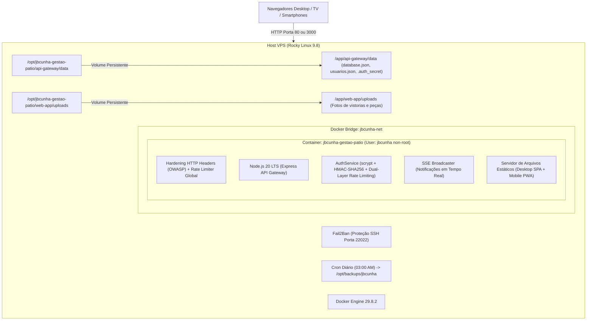

# ☁️ Guia de Infraestrutura, Arquitetura e Suporte na Nuvem (VPS)
### Central de Operações, Pátio & Manutenção — JB Cunha

---

## 1. Identificação Geral do Ambiente de Produção

A aplicação da **Central de Operações JB Cunha** encontra-se em ambiente de produção conteinerizado sob arquitetura moderna, segura e com observabilidade completa.

| Item | Especificação de Produção |
| :--- | :--- |
| **Endereço IP Público** | `129.121.45.248` |
| **Porta SSH de Gerência** | `22022` *(Atenção: porta não-padrão por segurança)* |
| **Usuário SSH** | `root` |
| **Portas Web Públicas** | `80` (HTTP direto - dispensando informar porta) e `3000` (porta direta) |
| **Sistema Operacional Host** | Rocky Linux 9.8 (Blue Onyx) — Kernel Linux 5.14 |
| **Ambiente de Execução** | Docker CE 29.8.2 + Docker Compose Plugin v5.5.1 |
| **Segurança Host** | Fail2Ban v1.0.2 com 23 jails ativas (incluindo jail `sshd`) |
| **DNS Configurado** | `1.1.1.1` (Cloudflare) e `8.8.8.8` (Google DNS) via NetworkManager |

### 🌐 URLs de Acesso Público da Aplicação

| Finalidade | URL de Acesso | Descrição Operacional |
| :--- | :--- | :--- |
| **Painel Desktop Principal** | `http://129.121.45.248/` | Gestão de pátio, abertura de OS, aprovação de orçamentos e relatórios |
| **Aplicativo Mobile (PWA)** | `http://129.121.45.248/mobile` | Interface otimizada para smartphones e tablets dos mecânicos/técnicos |
| **Modo TV (Zero-Scroll)** | `http://129.121.45.248/#tv` | Painel operacional fixo de baias para Smart TVs e monitores de galpão |
| **Healthcheck da API** | `http://129.121.45.248/api/jbc/v1/status` | Endpoint de monitoramento contínuo de disponibilidade e integridade |

---

## 2. Arquitetura da Solução na Nuvem



### Componentes de Software:
1. **Frontend**:
   - Vanilla ES6+, CSS3 com Design System institucional e CSS Custom Properties.
   - PWA Service Worker (`service-worker.js`) com manifesto offline para o time de campo.
   - Zero dependências de build pesadas no cliente (carregamento ultra-rápido).
2. **Backend API Gateway**:
   - Node.js 20 LTS com Express 4.19.
   - RBAC granular de 3 níveis: `admin` (Aprovador), `usuario` (Solicitante/Técnico) e `cliente` (Portal Externo segregado).
   - Server-Sent Events (SSE) em `/api/jbc/v1/mobile/events` para push updates em tempo real.
3. **Persistência de Dados**:
   - Formato Flat-file JSON com atomicidade via `fs.writeFileSync` síncrono e buffers em memória.
   - `database.json`: Veículos, baias, apontamentos de horas, peças e histórico de serviços.
   - `usuarios.json`: Credenciais criptografadas via `crypto.scrypt` com salt único por usuário.
   - `.auth_secret`: Chave criptográfica aleatória persistida de 96 caracteres hexadecimais para assinatura JWT.

---

## 3. Estrutura de Diretórios no Servidor Host

Toda a infraestrutura do sistema reside no diretório padrão `/opt`:

```
/opt/
├── jbcunha-gestao-patio/             # Repositório clonado e aplicação ativa
│   ├── .env                          # Variáveis de ambiente de produção (segredo JWT)
│   ├── docker-compose.yml            # Orquestração do container de produção
│   ├── Dockerfile                    # Receita da imagem Node 20 Alpine segura
│   ├── package.json                  # Dependências de produção
│   ├── api-gateway/
│   │   ├── server.js                 # Ponto de entrada do backend Express
│   │   ├── data/                     # [VOLUME PERSISTENTE] Banco de dados JSON
│   │   │   ├── database.json         # Base operacional do pátio
│   │   │   ├── usuarios.json         # Cadastro de usuários e credenciais com hash
│   │   │   └── .auth_secret          # Chave secreta de assinatura HMAC
│   │   └── src/
│   │       ├── config/               # Parâmetros de portas e diretórios
│   │       ├── middlewares/          # Middlewares de autenticação e RBAC
│   │       ├── routes/               # Rotas REST (/auth, /compras, /atendimentos, /mobile)
│   │       └── services/             # AuthService, Storage, GLPI Bridge
│   ├── web-app/
│   │   ├── index.html                # Painel Desktop & Modo TV
│   │   ├── mobile.html               # Aplicativo Mobile PWA
│   │   ├── css/                      # Folhas de estilo do Design System
│   │   ├── js/                       # Lógica reativa frontend (app.js)
│   │   └── uploads/                  # [VOLUME PERSISTENTE] Fotos enviadas pelos técnicos
│   └── scripts/
│       ├── setup_vps_host.sh         # Script utilitário de provisionamento
│       └── backup.sh                 # Rotina de compactação e backup
└── backups/
    └── jbcunha/                      # Destino das cópias diárias (.tar.gz)
```

---

## 4. Hardening de Segurança — Alinhamento NIST CSF 2.0

Para proteger o sistema contra ameaças cibernéticas na internet pública, foram implementadas medidas alinhadas às 5 funções do **NIST Cybersecurity Framework (CSF 2.0)**:

### 1. Identificar (ID — Identify)
* **Eliminação de Enumeração de Usuários (ID.RA):** A tela de autenticação mobile e desktop não exibe nomes sugeridos ou dicas no placeholder. O retorno de erro é universal (`Usuário ou senha inválidos`) tanto para usuário não encontrado quanto para senha errada.
* **Remoção de Atalhos de Desenvolvimento:** Foram expurgados do código-fonte HTML/JS quaisquer botões de *"Acesso Rápido"* ou senhas pré-preenchidas.
* **Saneamento e Validação Estrita de Input:** Campos de login aceitam apenas strings alfanuméricas com tamanho limitado a 64 caracteres para mitigar buffer overflows, prototype pollution ou ReDoS.

### 2. Proteger (PR — Protect)
* **Proteção Dupla contra Força Bruta (Dual-Layer Brute Force Defense - PR.AC):**
  1. **Camada de IP:** Limite de 10 tentativas falhas por IP em 10 minutos. O excedente é bloqueado por 15 minutos com status `429 Too Many Requests` e cabeçalho `Retry-After`.
  2. **Camada de Conta (Username Lockout):** Limite de 5 tentativas consecutivas de senha incorreta em uma mesma conta (mesmo vindo de múltiplos IPs diferentes). Se atingido, a conta é suspensa preventivamente por 15 minutos.
* **Mitigação de Timing Attacks (Timing Equalization):** Se uma tentativa de login visar um usuário que não existe, o sistema ainda assim executa o algoritmo criptográfico de derivação `scrypt` com um hash dummy para que o tempo de resposta da CPU seja idêntico ao de um usuário existente, impossibilitando scanners de adivinhar contas válidas pelo tempo de resposta.
* **Introdução de Jitter/Atraso Artificial:** Toda falha de login recebe um atraso assíncrono controlado (300ms a 600ms) antes de responder ao cliente, reduzindo ataques automatizados de dicionário de milhares de tentativas por segundo para menos de 2 req/s.
* **Criptografia Forte e Segredos (PR.DS):**
  * Senhas hasheadas via `crypto.scrypt` com salt criptográfico de 16 bytes e derivação de 64 bytes.
  * Tokens HMAC-SHA256 assinados com chave pseudo-aleatória de 96 caracteres hexadecimais (`AUTH_SECRET`).
  * Comparações sensíveis utilizando `crypto.timingSafeEqual`.
* **Hardening de Cabeçalhos HTTP (PR.PT):**
  * `X-Content-Type-Options: nosniff`
  * `X-Frame-Options: SAMEORIGIN`
  * `X-XSS-Protection: 0` (padrão moderno que mitiga vulnerabilidades do auditor legado)
  * `Referrer-Policy: strict-origin-when-cross-origin`
  * `Permissions-Policy: camera=(self), microphone=(), geolocation=()`
  * `Cross-Origin-Opener-Policy: same-origin`
  * `Cross-Origin-Resource-Policy: same-origin`
  * Desativação do header de identificação Express (`app.disable('x-powered-by')`).
* **Execução em Container Não-Root:** O processo Node.js roda sob o usuário sem privilégios `jbcunha` dentro do container Alpine, impedindo escalação de privilégios para o host.

### 3. Detectar (DE — Detect)
* **Logs de Auditoria Estruturados (DE.AE):**
  * Log estruturado para todas as falhas de autenticação com IP e alvo: `[SEC-AUDIT][AUTH_FAIL]`.
  * Alertas emitidos em tempo real para tentativas excessivas: `[SEC-ALERT][BRUTE_FORCE_IP]` e `[SEC-ALERT][ACCOUNT_LOCKOUT]`.
  * Logs com rotação automática configurada no Docker (20MB por arquivo, máximo 5 arquivos).
* **Fail2Ban no Host:** Proteção em tempo real da porta SSH `22022` que detecta scanners de portas e ataques de dicionário, inserindo regras dinâmicas de descarte de pacotes nas tabelas do kernel Linux.

### 4. Responder (RS — Respond)
* **Bloqueio Automático em Tempo Real (RS.RP):** Rejeição imediata de conexões abusivas com código HTTP 429 e tempo de retenção via `Retry-After`.

### 5. Recuperar (RC — Recover)
* **Backup Automatizado em Produção (RC.RP):** Agendamento diário às 03:00 no crontab do host que gera arquivos `.tar.gz` contendo todos os dados JSON e arquivos de imagem.

---

## 5. Manual Operacional e Guia de Suporte (Runbook)

### 5.1. Conexão Remota via SSH

Para acessar a máquina host:
```bash
ssh -p 22022 root@129.121.45.248
```

---

### 5.2. Como Verificar o Status da Aplicação

```bash
# 1. Verificar se o container está rodando e saudável (healthy)
docker ps

# Saída esperada:
# CONTAINER ID   IMAGE                               COMMAND                  STATUS                    PORTS
# xxxxxxxxxxxx   jbcunha-gestao-patio-gestao-patio   "docker-entrypoint.s…"   Up X hours (healthy)      0.0.0.0:80->3000/tcp, 0.0.0.0:3000->3000/tcp

# 2. Testar resposta local da API
curl -s http://127.0.0.1:3000/api/jbc/v1/status
```

---

### 5.3. Visualização de Logs em Tempo Real

```bash
# Acompanhar logs ao vivo da aplicação:
docker logs -f jbcunha-gestao-patio

# Filtrar apenas eventos e alertas de segurança:
docker logs jbcunha-gestao-patio | grep "SEC-"

# Ver últimas 100 linhas:
docker logs --tail 100 jbcunha-gestao-patio
```

---

### 5.4. Como Reiniciar a Aplicação

```bash
cd /opt/jbcunha-gestao-patio
docker compose restart
```

---

### 5.5. Como Aplicar Atualizações do GitHub (Deploy Contínuo)

Sempre que a equipe de desenvolvimento publicar novas versões na branch `main` do GitHub:

```bash
# 1. Navegar até o diretório do projeto
cd /opt/jbcunha-gestao-patio

# 2. Baixar as alterações do repositório
git pull origin main

# 3. Recompilar a imagem e recriar o container sem perda de dados
docker compose up -d --build

# 4. Validar o status após a atualização
sleep 5
docker ps
```
> *Nota: Os volumes de dados (`api-gateway/data`) e uploads (`web-app/uploads`) são persistidos no host e não são afetados durante a recriação do container.*

---

### 5.6. Procedimento de Backup e Restauração (Disaster Recovery)

#### Cópia Manual de Backup Imediato:
```bash
tar -czf /opt/backups/jbcunha/backup_manual_$(date +%Y%m%d_%H%M%S).tar.gz \
  -C /opt/jbcunha-gestao-patio api-gateway/data web-app/uploads
```

#### Restauração de Backup:
Caso haja corrupção acidental de dados e seja necessário restaurar uma cópia:
```bash
# 1. Parar a aplicação temporariamente
cd /opt/jbcunha-gestao-patio
docker compose stop

# 2. Restaurar o arquivo de backup escolhido (exemplo com o arquivo de 02/10/2026)
tar -xzf /opt/backups/jbcunha/backup_20261002.tar.gz -C /opt/jbcunha-gestao-patio/

# 3. Ajustar permissões para garantir acesso do container
chown -R 1000:1000 /opt/jbcunha-gestao-patio/api-gateway/data /opt/jbcunha-gestao-patio/web-app/uploads

# 4. Iniciar a aplicação novamente
docker compose start
```

---

### 5.7. Resolução de Incidentes Comuns (Troubleshooting)

| Sintoma / Problema | Causa Provável | Procedimento de Correção |
| :--- | :--- | :--- |
| **Site não abre no navegador** | Container parado ou porta 80 bloqueada | Execute `docker ps`. Se o container não estiver ativo, suba com `docker compose up -d`. Se a porta 80 conflitar com outro processo, use `ss -tulpn \| grep :80` para identificar e encerrar o serviço concorrente. |
| **Container marcado como `unhealthy`** | Healthcheck falhando | Verifique com `docker inspect jbcunha-gestao-patio --format='{{json .State.Health}}'`. O healthcheck utiliza `http://127.0.0.1:3000/api/jbc/v1/status`. |
| **Usuário bloqueado por excesso de tentativas** | Disparo do mecanismo anti-brute force | O bloqueio expira automaticamente após 15 minutos. Para liberação emergencial imediata, reinicie o container: `docker compose restart`. |
| **Fotos não carregam no mobile** | Permissões de diretório de upload | Execute no host: `chmod -R 775 /opt/jbcunha-gestao-patio/web-app/uploads`. |
| **IP do administrador bloqueado no SSH** | Fail2Ban baniu o IP | Verifique os banimentos com `fail2ban-client status sshd`. Para desbanir um IP: `fail2ban-client set sshd unbanip <SEU_IP>`. |
| **Disco do servidor ficando cheio** | Arquivos de log ou backups antigos | Verifique espaço com `df -h`. Remova backups com mais de 30 dias: `find /opt/backups/jbcunha/ -type f -name "*.tar.gz" -mtime +30 -delete`. Os logs do Docker já contam com rotação automática limitada a 20MB x 5. |

---

## 6. Matriz de Perfis e Credenciais Padrão

| Usuário | Perfil (Role) | Papel na Operação |
| :--- | :--- | :--- |
| `manuel` | `admin` | Aprovador / Diretor Geral (liberação de orçamentos e compras) |
| `expedito` | `admin` | Aprovador / Gerente de Operações (gestão completa do pátio) |
| `operador` | `usuario` | Solicitante / Mecânico Chefe (abertura de OS, requisição de peças) |

> 🔒 **Recomendação:** As senhas padrão de primeiro acesso (`jbc@2026`) devem ser alteradas no menu do perfil de cada usuário logado ou pelo painel de gerenciamento administrativo em `/usuarios`.
